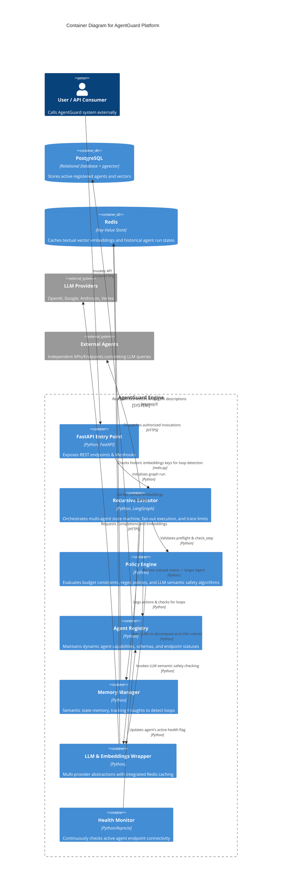
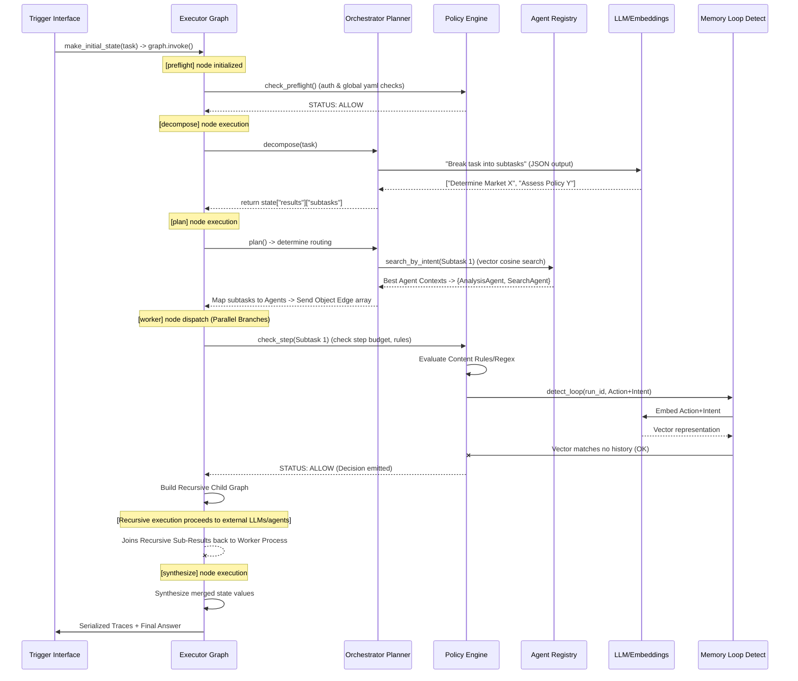
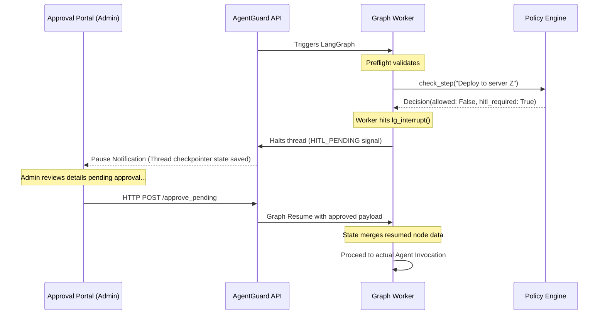

# AgentGuard: Detailed Engineering & Architecture Document

This document provides an exhaustive, engineering-level breakdown of the AgentGuard platform. It maps out the system architecture, component integration, and internal logic to serve as a comprehensive guide for developers reviewing or contributing to the application.

## 1. System Overview

AgentGuard is a policy-driven governance layer designed for autonomous, multi-agent AI systems. It intercepts AI agent graphs during execution to enforce cost constraints, contextual relevance, organizational policy, and ethical guidelines.

By relying on `LangGraph`, AgentGuard implements a recursive workflow that plans, routes, decomposes, and executes tasks. Prior to processing any agent task or subtask inference call, governance modules validate the execution dynamically, blocking non-compliant behavior or halting system execution for Human-In-The-Loop (HITL) approval.

---

## 2. Architecture Diagrams

### 2.1 C4 Container Diagram

The system boundaries are defined by its internal state machine, database abstractions, APIs, and connections to external LLM providers.

---

## 3. Core Components Breakdown: Detailed Code Analysis

### 3.1 LangGraph Orchestrator (`executor.py`, `state.py`, `orchestrator.py`) - Reviewed 4/17/2026

At the center of AgentGuard lies the `RecursiveExecutor`, built on LangGraph's functional mapping.
- **`AgentGuardState` (`state.py`)**: A `TypedDict` enforcing parallel state merging via `Annotated` parameters. For example, `all_edges` and `trace_events` use `operator.add`, while `usage_stats` uses a custom `_merge_usage` function to incrementally accumulate `total_cost`. The `make_initial_state` function provides boilerplate bootstrapping.
- **Graph Nodes & Edges (`executor.py`)**: 
  - `build_graph()`: Initializes a `StateGraph`, binds seven distinct node functions (`preflight`, `decompose`, `plan`, `worker`, `synthesize`, `collect_max_depth`, `reject`), and sets conditional routing (e.g., `_edge_post_preflight` routing to `reject` if blocked).
  - `_node_preflight()`: Isolates context, verifies JWT lifespan with `_auth_expired()`, and triggers `PolicyEngine.check_preflight`. Emits a root `TraceEvent`.
  - `_node_decompose()`: Uses the `ExecutionPlanner` to dynamically execute a prompt asking the LLM to output a JSON array of subtasks via `self.llm.invoke()`. It captures the string array via standard Regex extraction formatting.
  - `_edge_fan_out()`: A parallel-dispatch method. Evaluates constraints and returns a list of `langgraph.types.Send("worker", state_delta)` objects. This instructs LangGraph to spawn isolated coroutines for each required agent execution path dynamically.
  - `_node_worker()`: Defines recursive execution. Inside this function:
    1. Checks auth expiration and evaluates `check_step`.
    2. Intercepts blocks requiring HITL approval with LangGraph's native `interrupt([hitl_payload])`. Resumes when external input modifies the checkpointer.
    3. Triggers recursive graph evaluations locally: initializes a `child_state = make_initial_state(...)`, spawns a child `RecursiveExecutor`, and directly forces `child_graph.invoke(child_state)`.
  - `_node_synthesize()`: Resolves fan-in logic by iterating over `results` dict from parallel processes and combining results into a single scalar string `final_answer`.

### 3.2 Policy Engine & Governance (`policy.py`) - Reviewed 4/18/2026

Evaluates limits described in tenant YAML definitions against agent actions via `check_preflight` and `check_step`.
- **Constructor Execution**: Initializes internal cache and dependencies. File reading (`yaml.safe_load`) and regex rule pre-compilation (`re.compile`) are deferred and executed lazily on the first request via the `_get_policy` and `_compile_rules` methods, storing the result in `_policies_cache`.
- **Financial Enforcement**: Inside `check_step()`, checks absolute numbers parsing `cost_estimate` against dictionary configuration limits `per_step_limit_usd` and calculates bounds by merging cumulative limits from `usage_stats['total_cost'] + cost_estimate`.
- **Semantic Classification**: Constructs a raw classification proxy string analyzing `action` and `intent`, directly evaluated by `self.llm.invoke()`. Strips string output formatting parsing for an immediate `BLOCK` keyword before invoking normal rules parsing.
- **Loop Interception (`detect_loop`)**: Invokes `MemoryManager`, wrapping agent executions around historically matched vector mappings protecting against cascading autonomous errors. Captures boolean response values mapping against semantic equivalence.

### 3.3 Authorization Context (`auth.py`) - Reviewed 4/18/2026

Enforces security and identity configurations isolating execution behavior.
- **Data Encapsulation**: Relies on a unified `@dataclass` `AuthContext` injecting UUID default fields and verifying parameters logically via `is_expired()` (verifies `datetime.now(tz=utc)` vs `expires_at`).
- **Token Cryptography**: `create_token` uses the `pyjwt` library calling `encode()` merging payload mappings (`iat`, `exp`, `jti`, `sub`, `roles`) wrapping an OS environment standard symmetric block `AGENTGUARD_JWT_SECRET` through `HS256`. 
- **Graceful Developer Fallback**: The function `anonymous_context()` returns an exaggerated dummy structure extending expiration lifetimes strictly dedicated to bypass functionality for SDK stress tests shown in `poc.py`.

### 3.4 Vector Agent Registry (`registry.py`, `health_checker.py`, `db.py`) - Reviewed 4/22/2026

A decoupled directory for registered AI capacities.
- **SQL Driver Layer (`db.py`)**: Built atop the async `psycopg_pool.ConnectionPool` initializing `conninfo` dynamically loading parameters (`min_size`, `max_size`). Exposes robust methods (`execute`, `execute_one`, `execute_write`) natively yielding dictionary structures utilizing `psycopg.rows.dict_row`. Ensures table injection loading the module `register_vector`.
- **Dynamic Semantic Routing (`registry.py`)**: 
  - Exposes `register()` method accepting JSON parameter definitions mapping to `.execute_write()`. Generates vectors natively by evaluating string attributes against `self._compute_embedding(semantic_description)`.
  - Routes functionality on `.search_by_intent()`. Extracts cosine semantic distances utilizing native Postgres extensions specifically matching query clauses containing `ORDER BY embedding <=> %s::vector LIMIT %s`. Performs an automated fault bypass wrapping ILIKE string manipulation logic ensuring substring execution on API timeout errors.
- **Microservice Probe (`health_checker.py`)**: An infinite `while True` loop instantiated directly on the FastAPI `lifespan` hook. Loads configurations via `_timeout`, iterating over registry schemas extracting their endpoint API, wrapping HTTP queries over `httpx.AsyncClient().get()`. Updates relational status metadata via `update_health()` checking absolute numerical threshold counts parsing HTML responses `< 400`.

### 3.5 Memory Manager (`memory.py`) - Reviewed 4/22/2026

Preserves contextual states to avoid logical cascades.
- **State Connections**: Initiates `redis.from_url` wrapping an internal `try/except` clause parsing connectivity via `.ping()`. Exposes abstract setter keys dynamically utilizing native Python `json.dumps()` wrapping values formatting as strings avoiding storage complexities. Defers all connections gracefully towards a pure Python namespace memory structure if Redis drops dynamically.
- **Loop Parsing Algorithm (`detect_loop`)**: Determines semantic repetitions inside graph node actions. Tracks temporal lookback blocks dynamically iterating over `history[-lookback_window:]`. Captures local values embedding action configurations via `get_embeddings()`. Invokes pure python execution performing distance correlation computations internally mapped via `_cosine_similarity` calculating dot product comparisons evaluating constraints `mag_a * mag_b`. Rejects state execution immediately if output float calculation observes bounds `>= 0.92` (threshold definition).

### 3.6 LLM Provider Abstractions (`llm.py`) - Reviewed 4/22/2026

A factory module isolating dependencies against proprietary APIs.
- **Resolution Strategy**: Instantiates object configuration natively detecting OS environment arrays wrapping initialization clauses across proprietary langchain variables matching (`ChatGoogleGenerativeAI`, `ChatAnthropic`, `ChatOpenAI`, and `ChatVertexAI`).
- **Embedding Interceptor (`get_embeddings`)**: Provides the vectorization functionality evaluating default classes matching OpenAI text embeddings alongside Google counterparts. Wraps explicit configuration handling using `redis_client`.
- **Remote Deduplication Logic**: Defines a localized lambda evaluating internal logic executing string values wrapping `hashlib.sha256(text.encode("utf-8")).hexdigest()`. Calculates hash lookup states directly through `redis_client.get(cache_key)`. Aggregates unique cache misses mapping explicit payload calls reducing duplication before forcefully writing values directly overriding Redis using `setex` preserving states 2592000 milliseconds globally.

### 3.7 Causal Tracing Pipeline (`trace.py`) - Reviewed 4/22/2026

Provides native SIEM telemetry.
- **Event Factory (`new_event`)**: Abstracts data structures producing canonical tracking events populated dynamically wrapping properties passing logic from external states (`node`, `depth`, `agent_id`, `decision`, `duration_ms`). Initializes random UUID generators tracking specific execution branches matching isolated thread configurations natively.
- **Data Reduction (`dump`)**: Collects parallel executed graph trace keys into absolute arrays. Computes elapsed times statically mapping initial strings evaluating arrays against `datetime.fromisoformat()`. Computes mathematical difference attributes tracking standard node edges extracting `parent_event_id` keys formatting payload outputs into rigid JSON payload wrappers mapped correctly towards versions matching `1.0`.

---

## 4. Execution Sequence Logic

### 4.1 Nominal Subtask Execution Flow

The typical journey a task follows through the AgentGuard ecosystem is driven dynamically by graph recursion and parallel iteration.

### 4.2 Human-In-The-Loop Execution Flow

Crucial configuration scenarios that block independent inference execution to await administrative supervision.

---

## 5. Persistence, Fallbacks, and System Safety

AgentGuard is expressly built to be deployment resilient, using **graceful degradation** at almost every failure boundary.

- **Storage Downgrades**: If `PostgreSQL` is unavailable (bad configurations, offline networks), the `DatabaseManager` logs the anomaly and transparently swaps `pgvector` dependencies for identical `in-memory` execution utilizing substring ILIKE matching on intent processing.
- **Semantic Loops**: If Cloud Embeddings API's are offline or non-responsive, the system drops recursive tracking down from `cosine similarity` logic internally executing strict literal `exact-match` memory evaluation mapping.
- **Rate-Limiting Trace Caching**: `Redis` caches embedding queries statically (sha256 hash targets) for nearly 30 days. High velocity iteration tasks looping over similar system context structures do not generate explosive duplicate egress expenditure strings.
- **Fail Closed Strategy**: Any network corruption, unavailable token access, or dependency break across LLM Semantic safety checks instantly defaults the engine toward `False` block behaviors, assuring the highest security thresholds apply uniformly under duress. 
