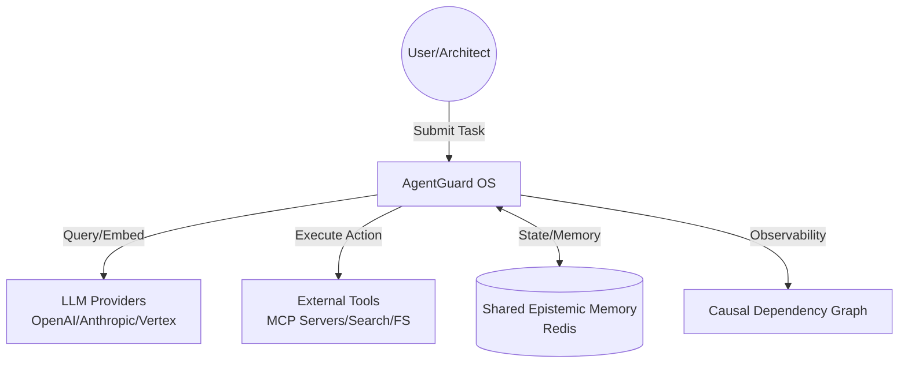
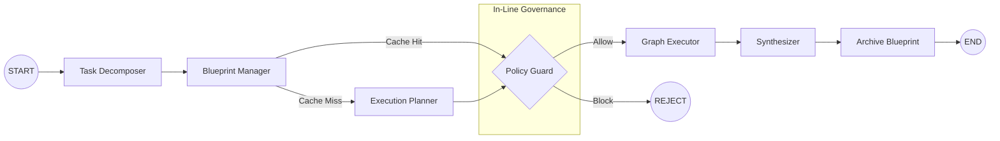
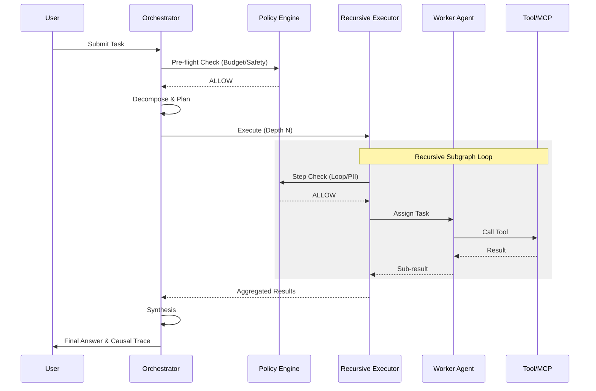

# AgentGuard: Technical Specification Document (TSD)

## 1. Introduction
AgentGuard is a high-performance, policy-driven agentic operating system designed for enterprise-grade autonomous tasks. It integrates the recursive execution capabilities of Project SSA with the governance and observability frameworks of Project ACP.

## 2. Architecture Overview
AgentGuard operates as a **Stateful Agent Mesh**.
- **Orchestrator:** Manages the task lifecycle, decomposition, and multi-agent coordination (SSA).
- **Policy Engine (Guard):** Enforces in-line safety, cost, and compliance rules (ACP).
- **Shared Epistemic Memory:** Persistent storage for global context, history, and embeddings (Redis).

### 2.1 System Context (C4 Level 1)


### 2.2 Container Diagram (C4 Level 2)
```mermaid
subgraph AgentGuard
    API[API/CLI Gateway]
    ORC[Global Orchestrator<br/>Main LangGraph]
    POL[Policy Engine<br/>Guard/Compliance]
    REC[Recursive Executor<br/>Worker Subgraphs]
    MEM[Memory Manager]
end

API --> ORC
ORC <--> POL
ORC --> REC
REC <--> POL
ORC <--> MEM
MEM <--> Redis
```

## 3. Core Use Cases (MVP)
1.  **Autonomous Research & Synthesis:** Breaking a complex research query into parallel sub-tasks while enforcing topic filters.
2.  **Governed Execution:** Running agent tasks (e.g., code generation) while ensuring they don't exceed budget or access forbidden data.
3.  **Recursive Decomposition:** Scaling execution to arbitrary depths for complex problems while maintaining state consistency and summarizing results.

## 4. System Context and Integrations
- **LLM Providers:** Supports OpenAI, Anthropic, and Vertex AI.
- **Tools:** Integrates with web search, filesystem, and specialized domain tools via the **Model Context Protocol (MCP)**.
- **Persistence:** Uses LangGraph checkpointers for short-term state and Redis for long-term shared memory.

## 5. LangGraph Graphs and Agents

### 5.1 Main Orchestrator Graph Flow


### 5.2 Request Sequence Diagram


### 5.3 Recursive Worker Subgraph (Detail)
- **Node: Recursive Executor:** Handles task execution at depth $N$.
- **Node: Mini-Planner:** Creates parallel sub-workers without full orchestrator overhead.
- **Node: Context Summarizer:** Compresses verbose outputs to prevent context overflow.

### 5.4 Capability Registry (The "Yellow Pages")
AgentGuard maintains a central **Registry Service** (Redis-backed) where all specialized agents and MCP tools register their metadata.
- **Metadata Fields:** `id`, `role`, `semantic_description`, `input_schema`, `output_schema`, and `endpoint`.
- **Discovery:** The `ExecutionPlanner` queries this registry using semantic search (vector similarity) to find the best agent/tool for a specific task intent.

### 5.5 Intent-Based Routing (The "Switchboard")
The `ExecutionPlanner` serves as the system's primary router, following a two-step safety protocol:
1.  **Intent Extraction:** An LLM-based module translates user/recursive tasks into structured **Intent Objects** (Action + Resource).
2.  **Graph-Constrained Lookup:** The Intent is validated against a **Capability Graph** (Whitelist). If no authorized path exists between the intent and a registered agent, the task is rejected. This prevents agents from attempting tasks outside their safety guardrails.

## 6. Data Model and State Management
### 6.1 Unified AgentGuardState
```python
class AgentGuardState(TypedDict):
    task: str
    subject: str
    root_task_id: str
    parent_node_id: str
    depth: int
    results: Dict[str, str]
    all_agents: List[Dict]
    all_edges: List[Dict]
    global_signal: str          # "OK" | "INTERRUPT" | "RETRY" | "REJECT" | "HITL_PENDING"
    usage_stats: Dict[str, float]
    budget_config: Dict[str, float]
    governance_decisions: List[GovernanceDecision]
    trace_events: List[Dict[str, Any]]   # append-only causal event log (Step A)
    auth_context: Dict[str, Any]         # JWT-derived caller identity (Step C)
    parent_trace_event_id: Optional[str] # causal link from parent graph (Step A+C)
```

`GovernanceDecision` fields: `action`, `allowed`, `reason`, `cost`, `hitl_required`.  
`hitl_required=True` distinguishes a human-approval pause from a hard block.

### 6.2 Shared Epistemic Memory (Redis)
- **Key: `run:{id}:history`** — Serialized thought history with embeddings for loop detection.
- **Key: `run:{id}:blueprints`** — Cached execution plans for reuse.
- **Key: `run:{id}:telemetry`** — Real-time "thoughts" for external observability.
- **Key: `run:{id}:state`** — Full `AgentGuardState` snapshot at run completion (REST API — Step B).
- **Key: `run:{id}:trace`** — Serialized trace JSON document (Step A artifact, served by `/runs/{id}/trace`).

## 7. Observability, Logging, and Metrics
- **Causal Dependency Graph:** Every run produces a machine-readable JSON trace of the reasoning chain.
- **Semantic Loop Detection:** Monitors the similarity of agent thoughts to prevent infinite recursion/stalls.
- **Cost Attribution:** Real-time USD cost tracking mapped to each agent and task ID.

## 7.5 REST API (FastAPI — `backend/`)

| Method | Path | Auth | Description |
|:-------|:-----|:-----|:------------|
| `GET` | `/health` | None | Redis + LLM liveness probe |
| `POST` | `/runs` | Bearer / API key | Submit task; returns `run_id` immediately (background) |
| `GET` | `/runs/{id}` | Bearer / API key | Status, `final_answer`, cost, governance summary |
| `GET` | `/runs/{id}/trace` | Bearer / API key | Download full trace JSON (Step A artifact) |
| `POST` | `/runs/{id}/approve` | Bearer + `approver` role | Approve/reject HITL_PENDING step; resumes graph |
| `GET` | `/policy` | Bearer / API key | Return active `policy.yaml` rules |
| `POST` | `/policy/reload` | Bearer / API key | Hot-reload policy without restart |

Run state machine: `queued → running → {completed | blocked | hitl_pending | error}`.  
`hitl_pending` transitions to `completed` or `blocked` via `POST /approve`.

## 8. Security and Safety Considerations
- **PII Redaction:** Automated scanning and redaction of sensitive data in inputs/outputs (Inline Policy).
- **Forbidden Topics:** Keyword and semantic filters to prevent unauthorized research/action.
- **Identity Propagation (implemented — Step C):**
    - `agentguard/auth.py` implements `AuthContext` (dataclass) and `create_token`/`decode_token` (HS256; RS256/JWKS planned).
    - JWT claims mapped to `AuthContext` fields: `sub→subject`, `tenant→tenant_id`, `roles`, `iat`, `exp`, `jti`.
    - `auth_context` is verbatim-copied into every child `AgentGuardState`, so governance decisions at any recursion depth carry `[subject:X]` in their `reason`.
    - Expired JWTs block execution at preflight and per-step; `require_approver()` enforces role-based access for HITL resume.
- **HITL (implemented — Step C):** `require_hitl` policy action triggers LangGraph `interrupt()`, pausing the graph and persisting state to Redis via checkpointer. Resume requires approver-role JWT via `POST /runs/{id}/approve`.

## 9. Scalability and Reliability
- **Recursive Limits:** Hard limits on recursion depth ($N=10$) to prevent runaway processes.
- **Summarization:** Dynamic compression of context to stay within LLM token limits.
- **Circuit Breaker:** Automatically halts failing agents or services after $X$ attempts.

## 10. Non-Functional Requirements
- **Latency:** Core graph overhead < 500ms (excluding LLM calls).
- **Efficiency:** ~60% reduction in LLM calls for recursive sub-tasks compared to a full orchestrator call.
- **Compliance:** 100% auditable reasoning chains for all tasks.

## 11. Future Roadmap: Agentic Marketplace
Beyond the MVP, AgentGuard aims to implement the **Contract-Net Marketplace** pattern for dynamic, market-driven task allocation.
- **Bidding System:** Agents will respond to task announcements with "Bids" containing their model confidence, estimated USD cost, and ETA.
- **Utility Selection:** The Orchestrator will award tasks based on a dynamic utility function, allowing for real-time trade-offs between cost, quality, and speed.
- **Distributed Negotiation:** Enables the system to scale across diverse, heterogeneous pools of specialized agents with fluctuating availability.

---
*Patterns Referenced:*
- *Causal Dependency Graph [NotebookLM]*
- *Pass-by-Reference Context [NotebookLM]*
- *Watchdog Timeout Supervisor [NotebookLM]*
- *Adaptive Retry with Prompt Mutation [NotebookLM]*
- *Capability Registry & Agent Router [NotebookLM]*
- *Contract-Net Marketplace [NotebookLM]*
**Bidding System:** Agents will respond to task announcements with "Bids" containing their model confidence, estimated USD cost, and ETA.
- **Utility Selection:** The Orchestrator will award tasks based on a dynamic utility function, allowing for real-time trade-offs between cost, quality, and speed.
- **Distributed Negotiation:** Enables the system to scale across diverse, heterogeneous pools of specialized agents with fluctuating availability.

---
*Patterns Referenced:*
- *Causal Dependency Graph [NotebookLM]*
- *Pass-by-Reference Context [NotebookLM]*
- *Watchdog Timeout Supervisor [NotebookLM]*
- *Adaptive Retry with Prompt Mutation [NotebookLM]*
- *Capability Registry & Agent Router [NotebookLM]*
- *Contract-Net Marketplace [NotebookLM]*
