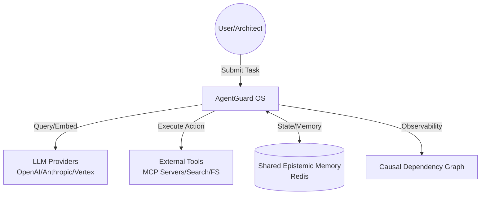
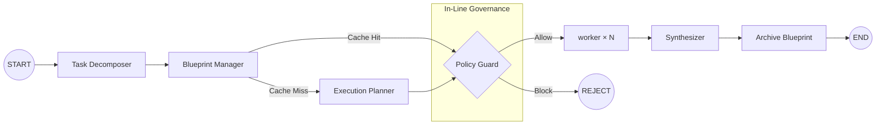
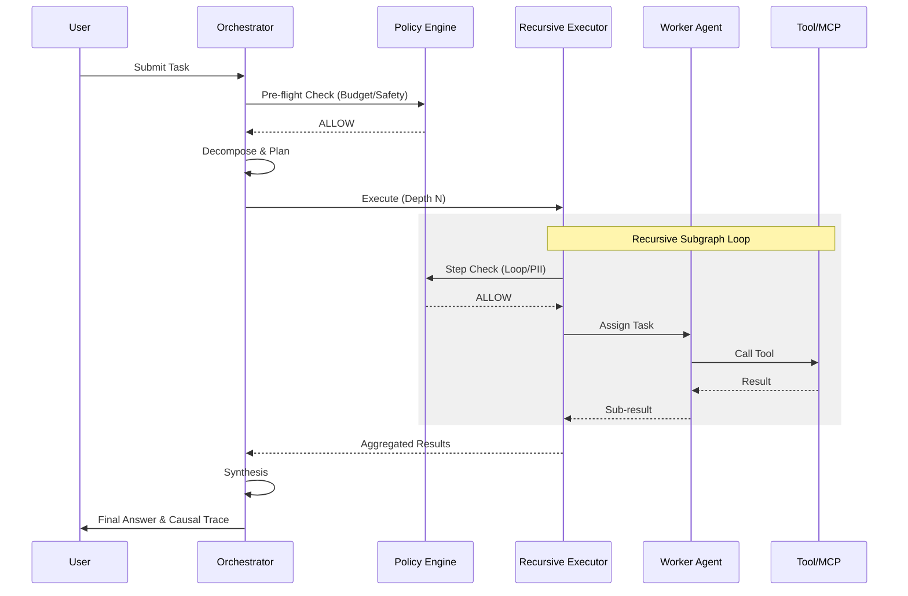

# AgentGuard: Technical Specification Document (TSD)

## 1. Introduction
AgentGuard is a high-performance, policy-driven agentic operating system designed for enterprise-grade autonomous tasks. It integrates the recursive execution capabilities of Project SSA with the governance and observability frameworks of Project ACP.

## 2. Architecture Overview
AgentGuard operates as a **Stateful Agent Mesh**.
- **Orchestrator:** Manages the task lifecycle, decomposition, and multi-agent coordination (SSA).
- **Policy Engine (Guard):** Enforces in-line safety, cost, and compliance rules (ACP).
- **Shared Epistemic Memory:** Persistent storage for global context, history, and embeddings (Redis).

### 2.1 System Context (C4 Level 1)


### 2.2 Container Diagram (C4 Level 2)
```mermaid
subgraph AgentGuard
    API[API/CLI Gateway]
    ORC[Global Orchestrator<br/>Main LangGraph]
    POL[Policy Engine<br/>Guard/Compliance]
    REC[Recursive Executor<br/>Worker Subgraphs]
    MEM[Memory Manager]
    DB[Database Manager<br/>PostgreSQL]
end

API --> ORC
ORC <--> POL
ORC --> REC
REC <--> POL
ORC <--> MEM
MEM <--> Redis
ORC <--> DB
API <--> DB
```

## 3. Core Use Cases (MVP)
1.  **Autonomous Research & Synthesis:** Breaking a complex research query into parallel sub-tasks while enforcing topic filters.
2.  **Governed Execution:** Running agent tasks (e.g., code generation) while ensuring they don't exceed budget or access forbidden data.
3.  **Recursive Decomposition:** Scaling execution to arbitrary depths for complex problems while maintaining state consistency and summarizing results.

## 4. System Context and Integrations
- **LLM Providers:** Supports OpenAI, Anthropic, and Vertex AI.
- **Tools:** Integrates with web search, filesystem, and specialized domain tools via the **Model Context Protocol (MCP)**.
- **Persistence:** Uses LangGraph checkpointers for short-term state, Redis for long-term shared memory, and PostgreSQL (pgvector) for the dynamic agent capability registry.

## 5. LangGraph Graphs and Agents

### 5.1 Main Orchestrator Graph Flow


### 5.2 Request Sequence Diagram


### 5.3 Recursive Worker Subgraph (Detail)
- **Node: Recursive Executor:** Handles task execution at depth $N$.
- **Node: Mini-Planner:** Creates parallel sub-workers without full orchestrator overhead.
- **Node: Context Summarizer:** Compresses verbose outputs to prevent context overflow.

### 5.4 Capability Registry (The "Yellow Pages")
AgentGuard maintains a central **Registry Service** (PostgreSQL-backed) where all specialized agents and MCP tools register their metadata dynamically via HTTP up-calls.
- **Metadata Fields:** `id`, `role`, `semantic_description`, `input_schema`, `output_schema`, `endpoint`, `is_active`, and `health_status`.
- **Discovery:** The `ExecutionPlanner` queries this registry using semantic search (vector similarity with pgvector's HNSW index) to find the best agent/tool for a specific task intent.

### 5.5 Intent-Based Routing (The "Switchboard")
The `ExecutionPlanner` serves as the system's primary router.
1. **Vector-Based Routing (Fast Path):** When PostgreSQL+pgvector is active, the raw subtask text is embedded and compared directly against agent `semantic_description` embeddings using cosine similarity. Zero per-subtask LLM calls are needed.
2. **Intent Extraction (Fallback):** If vector search is unavailable, an LLM-based module extracts a single-word intent verb from the subtask, and performs a substring lookup against the in-memory registry.

## 6. Data Model and State Management
### 6.1 Unified AgentGuardState
```python
class AgentGuardState(TypedDict):
    task: str
    subject: str
    root_task_id: str
    parent_node_id: str
    depth: int
    results: Dict[str, str]
    all_agents: List[Dict]
    all_edges: List[Dict]
    global_signal: str          # "OK" | "INTERRUPT" | "RETRY" | "REJECT" | "HITL_PENDING"
    usage_stats: Dict[str, float]
    budget_config: Dict[str, float]
    governance_decisions: List[GovernanceDecision]
    trace_events: List[Dict[str, Any]]   # append-only causal event log (Step A)
    auth_context: Dict[str, Any]         # JWT-derived caller identity (Step C)
    parent_trace_event_id: Optional[str] # causal link from parent graph (Step A+C)
```

`GovernanceDecision` fields: `action`, `allowed`, `reason`, `cost`, `hitl_required`.  
`hitl_required=True` distinguishes a human-approval pause from a hard block.

### 6.2 Shared Epistemic Memory (Redis)
- **Key: `run:{id}:history`** — Serialized thought history with embeddings for loop detection.
- **Key: `run:{id}:blueprints`** — Cached execution plans for reuse.
- **Key: `run:{id}:telemetry`** — Real-time "thoughts" for external observability.
- **Key: `run:{id}:state`** — Full `AgentGuardState` snapshot at run completion (REST API — Step B).
- **Key: `run:{id}:trace`** — Serialized trace JSON document (Step A artifact, served by `/runs/{id}/trace`).

## 7. Observability, Logging, and Metrics
- **Causal Dependency Graph:** Every run produces a machine-readable JSON trace of the reasoning chain.
- **Semantic Loop Detection:** Monitors the similarity of agent thoughts to prevent infinite recursion/stalls.
- **Cost Attribution:** Real-time USD cost tracking mapped to each agent and task ID.

## 7.5 REST API (FastAPI — `backend/`)

| Method | Path | Auth | Description |
|:-------|:-----|:-----|:------------|
| `GET` | `/health` | None | Redis + Postgres + LLM liveness probe |
| `POST` | `/runs` | Bearer / API key | Submit task; returns `run_id` immediately (background) |
| `GET` | `/runs/{id}` | Bearer / API key | Status, `final_answer`, cost, governance summary |
| `GET` | `/runs/{id}/trace` | Bearer / API key | Download full trace JSON (Step A artifact) |
| `POST` | `/runs/{id}/approve` | Bearer + `approver` role | Approve/reject HITL_PENDING step; resumes graph |
| `GET` | `/policy` | Bearer / API key | Return active `policy.yaml` rules |
| `POST` | `/policy/reload` | Bearer / API key | Hot-reload policy without restart |
| `POST` | `/agents/register` | Bearer / API key | Register or update an agent (upsert) |
| `GET` | `/agents` | Bearer / API key | List all active agents |
| `GET` | `/agents/{id}` | Bearer / API key | Get a single agent by ID |
| `DELETE` | `/agents/{id}` | Bearer / API key | Soft-deactivate an agent |
| `POST` | `/agents/{id}/activate` | Bearer / API key | Re-activate a deactivated agent |
| `POST` | `/agents/search` | Bearer / API key | Search agents by natural-language intent |

Run state machine: `queued → running → {completed | blocked | hitl_pending | error}`.  
`hitl_pending` transitions to `completed` or `blocked` via `POST /approve`.

## 8. Security and Safety Considerations
- **PII Redaction:** Automated scanning and redaction of sensitive data in inputs/outputs (Inline Policy).
- **Forbidden Topics:** Keyword and semantic filters to prevent unauthorized research/action.
- **Identity Propagation (implemented — Step C):**
    - `agentguard/auth.py` implements `AuthContext` (dataclass) and `create_token`/`decode_token` (HS256; RS256/JWKS planned).
    - JWT claims mapped to `AuthContext` fields: `sub→subject`, `tenant→tenant_id`, `roles`, `iat`, `exp`, `jti`.
    - `auth_context` is verbatim-copied into every child `AgentGuardState`, so governance decisions at any recursion depth carry `[subject:X]` in their `reason`.
    - Expired JWTs block execution at preflight and per-step; `require_approver()` enforces role-based access for HITL resume.
- **HITL (implemented — Step C):** `require_hitl` policy action triggers LangGraph `interrupt()`, pausing the graph and persisting state to Redis via checkpointer. Resume requires approver-role JWT via `POST /runs/{id}/approve`.

## 9. Scalability and Reliability
- **Recursive Limits:** Hard limits on recursion depth ($N=10$) to prevent runaway processes.
- **Summarization:** Dynamic compression of context to stay within LLM token limits.
- **Circuit Breaker:** Automatically halts failing agents or services after $X$ attempts.

## 10. Non-Functional Requirements
- **Latency:** Core graph overhead < 500ms (excluding LLM calls).
- **Efficiency:** ~60% reduction in LLM calls for recursive sub-tasks compared to a full orchestrator call.
- **Compliance:** 100% auditable reasoning chains for all tasks.

## 11. Agent Registry Pattern

### 11.1 What the Registry Is

The `Registry` is the system's "Yellow Pages" — a catalog of every agent and tool available for the executor to route work to. The `ExecutionPlanner` consults it when mapping a subtask to an agent. Because the registry is dynamic, agents can register themselves at runtime using the REST API without requiring a code change or server redeploy.

Every registered agent has several metadata fields:

| Field | Purpose | Example |
|:------|:--------|:--------|
| `id` | Stable unique identifier | `"trade_execution_agent"` |
| `role` | Human-readable capability label | `"Trade Execution Specialist"` |
| `semantic_description` | Full prose description — embedded via LLM API and stored as a vector for semantic routing | `"Constructs FIX order tickets, routes to execution venues..."` |
| `input_schema` | Expected inputs (used for validation and prompt construction) | `{"ticker": "string", "quantity": "int"}` |
| `output_schema` | Output contract | `{"order_id": "string", "fill_price": "float"}` |
| `endpoint` | Optional HTTP endpoint for remote agents | `"https://agents.internal/trade"` |
| `is_active` | Boolean toggle for agent availability | `true` |
| `health_status` | Status from background health checker | `"healthy"` |

### 11.2 Agent Lifecycle

```
Agent pod starts up
       │
       ▼
POST /agents/register { "id": "search_01", "role": "Search", ... }
       │
       ▼
(AgentGuard embeds semantic_description and upserts to PostgreSQL + pgvector)
       │
       ▼
ExecutionPlanner.plan() called for a subtask ("Find Q3 MSFT earnings")
       │
       ├── AgentGuard embeds the full subtask string
       │
       ├── registry.search_by_intent(subtask) queries PostgreSQL
       │     `SELECT ... FROM agent_registry ORDER BY embedding <=> $1 LIMIT 1`
       │
       └── returns top-matching agent → executor picks it
                  │
                  ▼
       PolicyEngine.check_step(action="invoke_{agent_id}", intent=...)
                  │
          ALLOW → executor invokes agent (LLM call or HTTP call to its endpoint)
          BLOCK → step denied, trace event emitted
          HITL  → graph pauses, waits for human approval
```

### 11.3 Graceful Degradation & Fallback

The AgentGuard registry is designed to be highly resilient:
- **Missing Database:** If `DATABASE_URL` is omitted, the registry degrades to a purely in-memory dictionary.
- **Routing Fallback:** If vector search is unavailable, `ExecutionPlanner` falls back to its legacy mode: it uses an LLM to extract a single-word intent verb from the text, and performs a simple case-insensitive substring scan over the agents.
- **Background Health Checks:** A background task (`AgentHealthChecker`) periodically probes the `endpoint` of registered agents. Agents failing $N$ consecutive health checks are marked `unhealthy` but remain in the registry until hard-deleted.

---

## 12. Customer Interaction Modes

Customers interact with AgentGuard through four distinct surfaces, each targeting a different persona.

### 12.1 REST API — Language-Agnostic Clients

The primary integration point for production systems. Any language, any platform.

```
# Submit a task
POST /runs
{
  "task": "Analyze MSFT Q3 earnings and update price target",
  "subject": "s.okafor@meridian.com",
  "budget_override": {"max_cost_usd": 2.00},
  "max_depth": 2
}
→ 202 { "run_id": "run_abc123", "status": "running" }

# Poll status
GET /runs/run_abc123
→ 200 { "status": "completed", "final_answer": "...", "total_cost_usd": 0.42 }

# Download full audit trace
GET /runs/run_abc123/trace
→ 200 { "schema_version": "1.0", "events": [...], "edges": [...] }

# Approve a paused HITL step (requires approver JWT role)
POST /runs/run_abc123/approve
Authorization: Bearer <approver_jwt>
{ "event_id": "evt_009", "approved_by": "c.reyes@meridian.com", "decision": "approve" }
→ 200 { "status": "resumed" }
```

**Target persona:** Platform/DevOps teams, non-Python services, web UIs.

---

### 12.2 Python SDK — Direct Integration

Import `agentguard` directly and compose the governance layer in code. Full control over the registry, state, and graph lifecycle.

```python
from agentguard import AgentGuardState, MemoryManager, Registry, RecursiveExecutor
from agentguard.auth import make_auth_context

# Build the agent registry for your domain
registry = Registry()
registry.register(
    item_id="fundamental_analyst",
    role="Fundamental Analyst",
    semantic_description="Analyzes SEC filings and produces buy/hold/sell ratings.",
    input_schema={"ticker": "string"},
    output_schema={"rating": "string", "price_target": "float"},
)

# Create caller identity
auth = make_auth_context("s.okafor@meridian.com", roles=["analyst", "approver"])

# Build and run the graph
memory   = MemoryManager()
executor = RecursiveExecutor(memory_manager=memory, registry=registry, max_depth=2)
graph    = executor.build_graph()

state = AgentGuardState(
    task="Analyze MSFT Q3 earnings and update price target",
    subject=auth.subject,
    root_task_id="run_001",
    parent_node_id="root",
    depth=0,
    results={},
    all_agents=[], all_edges=[],
    global_signal="",
    usage_stats={"total_cost": 0.0},
    budget_config={"max_cost_usd": 2.00},
    governance_decisions=[],
    trace_events=[],
    auth_context=auth.to_dict(),
    parent_trace_event_id=None,
)

final = graph.invoke(state)
print(final["results"]["final_answer"])
```

**Target persona:** Python ML/AI engineers embedding governance into existing pipelines.

---

### 12.3 Policy YAML — Declarative Governance

Governance rules are owned by compliance teams, not engineers. No code change required to add, modify, or disable a rule — edit `policy.yaml` and call `POST /policy/reload`.

```yaml
# policy.yaml — compliance team owns this file
budget:
  max_cost_usd: 5.00
  per_step_limit_usd: 1.50

content_rules:
  - id: block_sanctioned_entities
    field: intent
    operator: contains
    values: [novatek, sberbank, gazprom]
    action: block
    reason: "OFAC sanctions list match."

  - id: hitl_large_trades
    field: action
    operator: contains
    values: [execute_trade, submit_order]
    action: require_hitl
    reason: "Trade execution requires compliance pre-clearance."
```

Hot-reload without restart:
```
POST /policy/reload  →  { "reloaded": true, "rules_count": 6 }
```

**Target persona:** Compliance officers, legal teams, security engineers.

---

### 12.4 Policy Scoping — Per-Tenant Rules (Planned — U-11)

Today, one `policy.yaml` applies to all runs on a server. Three architectural paths are being evaluated for multi-tenant isolation:

**Option A — Policy-per-tenant at request time (Recommended MVP)**
`RunCreateRequest` adds a `policy_id` field. The backend resolves `policies/{tenant_id}.yaml` when building the executor for that run. Lowest complexity; maps cleanly to the existing `POLICY_FILE` env var pattern.

```
POST /runs
{
  "task": "...",
  "policy_id": "meridian-capital"   ← new field
}
→ PolicyEngine loads policies/meridian-capital.yaml for this run only
```

**Option B — Layered inheritance (Recommended GA)**
A base platform policy (PII, budget floor, offensive-security block) applies to all tenants and cannot be overridden. A tenant overlay adds domain-specific rules on top. Prevents tenants from disabling platform-level safeguards — critical for SaaS liability.

```
platform_base.yaml          ← immutable platform rules (PII, sanctions, budget floor)
    └── meridian.yaml       ← tenant overlay (adds HITL thresholds, OFAC list)
        └── desk_pm.yaml    ← role overlay (senior PM gets higher budget cap)
```

**Option C — Agent-declared policy (Future)**
Each agent declares its own required policy constraints at registration time. The `PolicyEngine` merges agent-level rules with the global policy at routing time. Most powerful — enables marketplace agents from third-party vendors to bring their own compliance posture. Highest implementation complexity; deferred to post-GA.

---

*Patterns referenced: Causal Dependency Graph · Capability Registry & Agent Router · Watchdog / Semantic Guardrail · Shared Epistemic Memory · Supervisor Architecture.*
chdog / Semantic Guardrail · Shared Epistemic Memory · Supervisor Architecture.*
